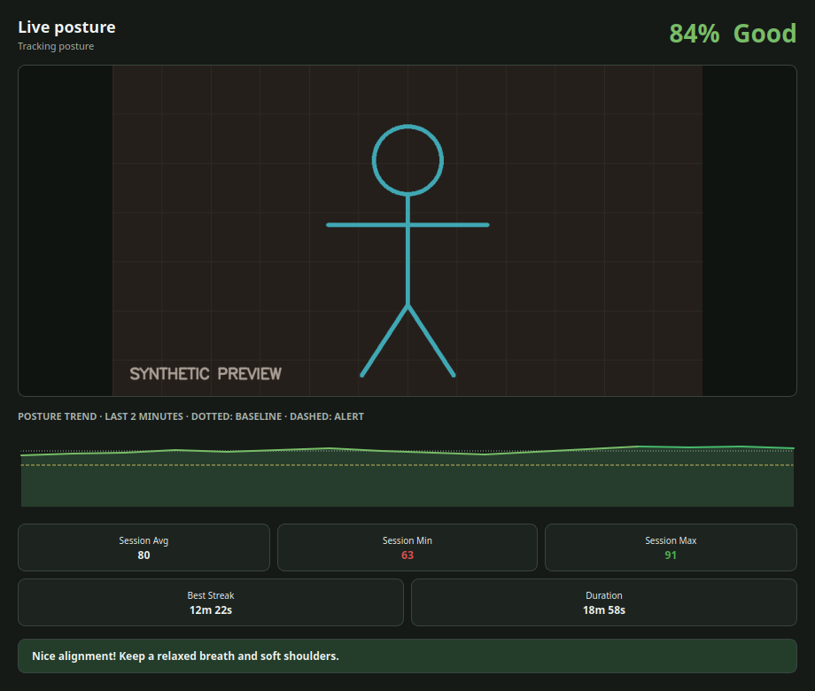
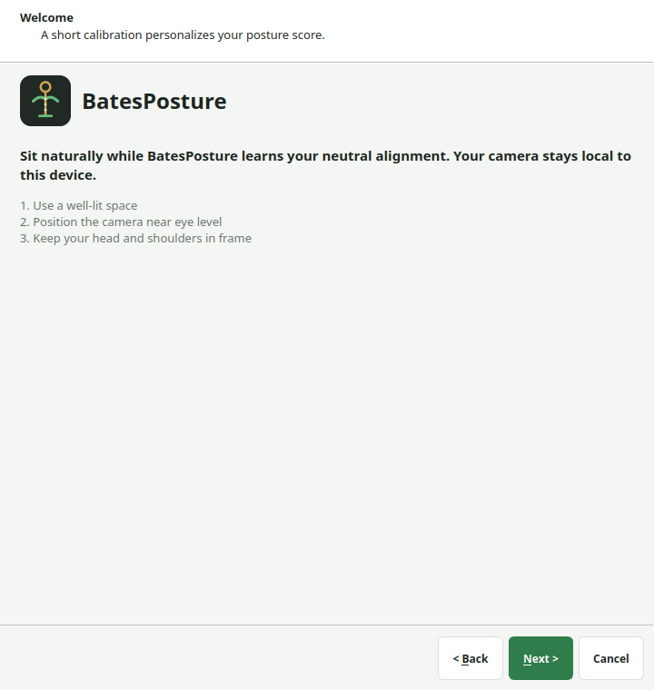

<div align="center">

# BatesPosture

**A local-first desktop posture monitor. Webcam in, private posture feedback out.**

[](https://github.com/wtbates99/batesposture/actions/workflows/data-checks.yml)
[](https://www.python.org/)
[](https://developers.google.com/edge/mediapipe/solutions/vision/pose_landmarker)
[](LICENSE)

[**Install**](#install) · [**How it works**](#how-it-works) · [**Goals**](#goals) · [**vs. SitSense**](#batesposture-vs-sitsense) · [**Privacy**](#privacy) · [**License**](#license)

</div>



BatesPosture watches a webcam locally, scores posture from 0–100, and sends a
native notification when posture drops below a personal threshold. Calibration
tunes the measurements to the person using the app. There are no accounts,
cloud uploads, or telemetry.

## Fork notice

This fork builds on the original [`wtbates99/batesposture`](https://github.com/wtbates99/batesposture)
by William Bates, which established the core tray app: MediaPipe-driven pose
scoring, calibration, the dashboard, notifications, scheduling, and SQLite/CSV
logging. Everything in **What it provides**, **How it works**, and **Privacy**
below describes that original design except where noted.

This fork adds:

- **Sit / stand desk modes** — separate calibrated baselines for sitting and
  standing, a tray **Desk Mode** menu, hotkeys (`Ctrl+Alt+1` sit,
  `Ctrl+Alt+2` stand, `Ctrl+Alt+R` recalibrate), a prompt when you return to
  the desk asking which mode to resume in, and a `mode` column on logged
  scores and CSV exports. See [`CLAUDE_SIT_STAND.md`](CLAUDE_SIT_STAND.md)
  for the full technical rundown and [`sit-stand.patch`](sit-stand.patch) for
  the diff against upstream.
- Bug fixes uncovered while wiring that feature up: a presence-debounce edge
  case that could never confirm on a zero-second threshold, a return-prompt
  dialog that could block indefinitely, and stale test fixtures.
- **Windows Hello compatibility** — the camera is released while the Windows
  lock screen is up and reopened on unlock, so signing back in with Hello no
  longer fights BatesPosture for the webcam. See the Troubleshooting section.
- **History window** (tray → **History…**) — a local report over logged
  scores: lookback ranges from Today to All history, sit/stand kept as
  separate series throughout (never averaged together), a score-over-time
  chart, daily and hour-of-day means, a weekday × hour heatmap, a score
  histogram, and a recent-rows table that flags lost-pose reads instead of
  treating them as slumped posture. You can merge in an older CSV export and
  re-export the merged history. Everything here reads the local SQLite
  database — no server, no account.
- **Candles & Scatter tab** (inside History) — the same logged scores as
  1-minute or 5-minute OHLC candlesticks (colored by whether the candle
  closed up or down) or as a raw scatter of every point, either way overlaid
  with a Bollinger-style band: a rolling mean ± 2 standard deviations over
  the trailing 20 candles, computed separately per mode.
- **Ctrl+Alt+T global hotkey** — starts tracking from anywhere, not just
  while a BatesPosture window has focus. Unlike the sit/stand hotkeys above
  (which are ordinary Qt menu shortcuts and only fire while a BatesPosture
  window is focused), this one is registered with Windows itself
  (`RegisterHotKey`), so it works while any other application is focused, as
  long as you're logged in. Windows only; a no-op elsewhere.

It intentionally does **not** add a sit/stand classifier — the webcam framing
can only hint which mode you're in, and the user confirms.

This repository is a real GitHub fork of `wtbates99/batesposture` (not a
copy), named `batesposture-sitstand` since `batesposture` was already taken
under this account. That keeps the fork relationship intact so changes here
can be proposed back upstream via pull request later.

## What it provides

| Capability | Behavior |
| --- | --- |
| Live score | Seven weighted pose metrics become a color-coded 0–100 tray score |
| Personal calibration | A six-second baseline adjusts feedback to the user's natural posture |
| Session dashboard | History, average, minimum, maximum, best streak, and duration |
| Smart alerts | Native notifications with threshold, cooldown, and focus controls |
| Scheduling | Continuous or interval tracking plus configurable break reminders |
| Local history | Optional SQLite logging and CSV export |
| Adaptive processing | Frame-size and performance controls for slower hardware |
| Auto-pause | Away-from-desk time is excluded when no person is detected |
| Sit / stand modes | Separate sitting and standing baselines, tray switch, return prompt, CSV `mode` column |
| History window | Lookback report over logged scores: timeline, daily/hourly means, heatmap, histogram |



## Install

Requires Python 3.10 or newer, [uv](https://docs.astral.sh/uv/), and a webcam.

```bash
git clone https://github.com/dakotagrusak/batesposture-sitstand.git
cd batesposture-sitstand
uv sync --locked --all-groups
uv run batesposture
```

Grant camera permission and complete the calibration when prompted.

<details>
<summary><strong>Linux system packages</strong></summary>

On Debian or Ubuntu:

```bash
sudo apt-get update
sudo apt-get install -y \
  libgl1 libglib2.0-0 \
  libxcb-xinerama0 libxcb-cursor0 libxcb-icccm4 libxcb-image0 \
  libxcb-keysyms1 libxcb-randr0 libxcb-render-util0 libxcb-shape0 \
  libxcb-xfixes0 libxkbcommon-x11-0 libegl1
```

GNOME users may also need an AppIndicator extension for the tray icon.

</details>

## How it works

1. **Calibrate** — capture a six-second baseline of the user's natural
   posture, per desk mode (sit / stand).
2. **Track** — MediaPipe Pose Landmarker locates 33 body landmarks per frame;
   seven of them feed geometric posture measurements.
3. **Score** — weighted measurements are compared against the active mode's
   baseline to produce one 0–100 posture score.
4. **Alert** — a sustained low score triggers a cooldown-controlled
   notification; stepping away and coming back triggers a mode-resume prompt.
5. **Review** — the dashboard shows the current session and optional saved
   history.

## Why MediaPipe

Pose detection uses Google's [MediaPipe Pose
Landmarker](https://developers.google.com/edge/mediapipe/solutions/vision/pose_landmarker),
which is itself a neural network: **BlazePose**, a convolutional network with
a MobileNetV2-style backbone, refined by GHUM, Google's 3D human shape model.
It runs entirely on-device — no frame ever needs a network call — and returns
33 3D body landmarks (shoulders, hips, ears, elbows, etc.) per frame.

BatesPosture does not train or ship its own pose-estimation model. It takes
MediaPipe's landmark output and layers a deterministic, transparent scoring
step on top: seven geometric measurements (neck angle, spine angle, shoulder
tilt, framing distance, and related metrics) are weighted and compared
against the user's calibrated baseline for the active desk mode. That scoring
function is a fixed formula, not a learned model — the six-second calibration
step is what personalizes it to a given body and desk setup, not training
data.

## Goals

BatesPosture's direction is **prompt-based posture correction**: rather than
only reporting a score after the fact, use what the webcam already sees —
sustained slouching, a mode change, time away from the desk — to nudge the
user in the moment, with feedback specific enough to act on immediately. The
sit/stand return-prompt in this fork ("You're back — Sitting / Standing /
Recalibrate / Keep last mode?") is a first step in that direction. Longer
term, the goal is to reduce the physical fatigue and health cost of long
stretches in front of a screen — neck and back strain, eye fatigue, reduced
circulation from static sitting — with timely, local, low-friction nudges
rather than a dashboard nobody checks.

## `BatesPosture` vs. SitSense

[SitSense](https://www.sitsense.app/about) is a comparable posture-tracking
product, shipped as a browser extension. Based on its public "About" page,
here's how the two compare:

| | BatesPosture | SitSense |
| --- | --- | --- |
| Form factor | Native desktop app (tray icon) | Chrome extension |
| Where video is processed | Locally, on-device | Locally, in-browser (per SitSense's own privacy claims) |
| Pose model | MediaPipe Pose Landmarker (BlazePose CNN, on-device, open and documented) | Unspecified — SitSense does not publish model architecture or provider |
| Posture scoring | Deterministic geometric formula over landmark angles, weighted and thresholded, fully inspectable in source | Not published; likely model-driven given no disclosed scoring formula |
| Calibration | ~6-second guided baseline per desk mode (sit / stand) required before scoring means anything for that body/desk | Not documented as a required step |
| Account / cloud | None — no signup, no server, everything stays on the machine | Saves "numerical posture metrics" for progress tracking, and offers a paid AI coaching tier — implying some server-side component beyond the local video pipeline |
| Source | Open, source-available (PolyForm Noncommercial) | Closed source |
| Price | Free, self-hosted | Free tier + paid coaching tiers |

The honest summary: both claim to keep video processing local and off any
server, which is the right default for a webcam-based tool. The real
difference is calibration and transparency, not cloud vs. local — BatesPosture
asks for an explicit, short calibration per mode and scores posture with an
inspectable formula anyone can read in `posture_mode.py`; SitSense doesn't
document a calibration step or its scoring internals, and its paid coaching
tier implies some data leaves the browser even though raw video doesn't.

## Configuration

Settings are available in the desktop UI and through environment variables:

```bash
POSTURE_RUNTIME_DEFAULT_CAMERA_ID=1 uv run batesposture
POSTURE_RUNTIME_DEFAULT_FPS=15 uv run batesposture
POSTURE_RUNTIME_POOR_POSTURE_THRESHOLD=55 uv run batesposture
```

Environment names follow `POSTURE_<SECTION>_<FIELD>` for runtime, ML, and
profile settings.

## Privacy

- Video frames are processed locally and are not uploaded.
- Posture data does not leave the machine.
- There are no accounts, analytics, or telemetry.
- SQLite logging is opt-in and disabled by default.
- README screenshots use synthetic imagery and contain no biometric data.

Data locations vary by platform:

| Data | Location |
| --- | --- |
| Database and lock | Linux `~/.local/share/BatesPosture/`; macOS application support; Windows `%APPDATA%` |
| Logs | macOS `~/Library/Logs/BatesPosture/app.log`; other platforms `~/.batesposture_logs/app.log` |
| CSV exports | `~/posture_export_YYYYMMDD_HHMMSS.csv` |

## Development

```bash
uv sync --locked --all-groups
QT_QPA_PLATFORM=offscreen uv run python -m pytest
uv run pre-commit run --all-files
uv build
```

## Troubleshooting

- **Camera does not open:** close other camera applications or try camera index `1`.
- **Tracking pauses:** make sure the head and shoulders are visible and evenly lit.
- **Performance is poor:** lower FPS or frame size and enable adaptive resolution.
- **CSV export is empty:** enable database logging before recording a session.
- **Windows Hello won't open the camera while tracking is on:** OpenCV holds
  an exclusive lock on the webcam while a session is active, and Hello can't
  take the device from another app. BatesPosture releases the camera as soon
  as the lock screen appears and reopens it automatically on unlock, so
  locking your PC and signing back in with Hello should just work. If you're
  on a version from before that change, the workaround is to stop tracking
  from the tray menu before locking the PC.

## License

BatesPosture is **source available** under the
[PolyForm Noncommercial License 1.0.0](LICENSE). Personal and noncommercial
use is permitted under those terms. Commercial use requires a
[separate license](COMMERCIAL-LICENSE.md).

Earlier revisions remain governed by the terms under which they were
published; see [license history](LICENSE_HISTORY.md).
